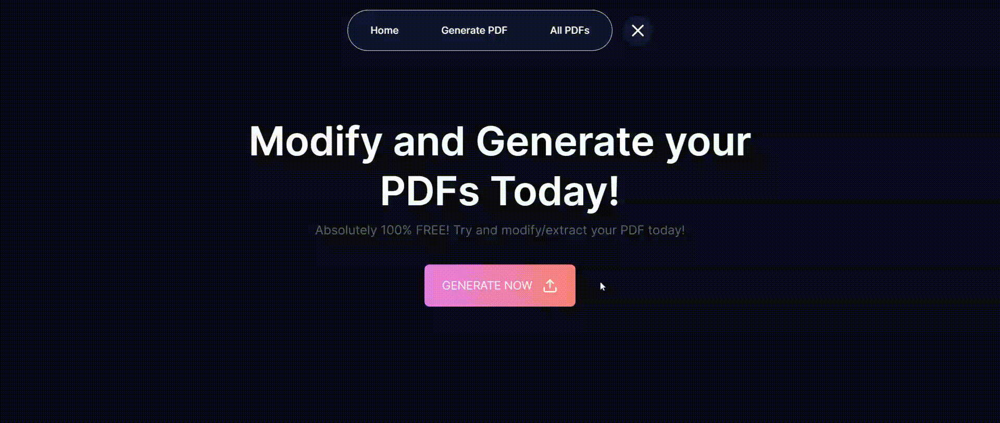

### Please check [README-TASK.md](./README-TASK.md) to check the tasks status of the project! [or CLICK HERE](./README-TASK.md)

# PDF Extractor Web Application: [FULL STACK MERN APP]

The PDF Extractor Web Application is a tool that empowers users to upload PDF files and extract specific pages to create a new PDF document. Users can easily select pages from the uploaded PDF, preview them visually, and generate a new PDF with their chosen pages. Whether you need to extract specific chapters from a lengthy document or compile a customized document from various sources, this application simplifies the process with its intuitive interface and efficient functionality.

#### **Frontend:** [Live Demo](https://pqr.com) | [Github Repo](https://xyz.com)
#### **Backend:** [Live Demo](https://xyz.com) | [Github Repo](https://xyz.com) 

## Table of Contents

1. [About](#about)
2. [Project Overview](#project-overview)
3. [Project Demo](#project-demo)
    - [Home Page & Upload PDF Form Submission](#home-page--upload-pdf-form-submission)
    - [Select PDF pages and edit file name to start generation](#select-pdf-pages-and-edit-file-name-to-start-generation)
    - [Download PDF and check downloaded pdf](#download-pdf-and-check-downloaded-pdf)
    - [Check all the generated and uploaded pdf](#check-all-the-generated-and-uploaded-pdf)
4. [Installation](#installation)
5. [Usage](#usage)
6. [Technologies Used](#technologies-used)
7. [Deployment](#deployment)
   - [Frontend Deployment](#deployment-instructions)
   - [Backend Deployment](#deployment-instructions)
8. [Contributing](#contributing)
9. [License](#license)

## About

The PDF Extractor Web Application is designed to streamline the process of extracting and compiling PDF documents. With its user-friendly interface and robust backend infrastructure, users can effortlessly upload PDF files, select pages of interest, and generate a new PDF document tailored to their needs. The application ensures a seamless experience, providing visual representation of pages, error-free PDF extraction, and secure download options. Whether you're a student, professional, or enthusiast needing to manipulate PDF documents, this application offers a convenient solution for your document extraction needs.

## Project Overview

The project consists of a web application that enables users to upload PDF files and extract specific pages to create a new PDF. Users can select the desired pages from the uploaded PDF and generate a new PDF document with the chosen pages.

## Project Demo

### Home Page & Upload PDF Form Submission

### Select PDF pages and edit file name to start generation

.gif)

### Download PDF and check downloaded pdf

.gif)

### Check all the generated and uploaded pdf

.gif)

## Installation

Steps to Create Project:

1. **Clone Repositories:**
    - Clone repository x for Node.js backend.
    - Clone repository y for Next.js frontend.

2. **Set up Backend:**
    - Navigate to the backend repository (x).
    - Run npm install to install dependencies.
    - Create a .env file and set MONGODB_URI variable.
    - Run the server using npm start.
    - Set up Frontend:

3. **Set up Frontend:**
    - Navigate to the frontend repository (y).
    - Run npm install to install dependencies.
    - Create a .env file and set NEXT_PUBLIC_BACKEND_URL (local host URL on which your backend is running) variable.
    - Run the development server using npm run dev.

4. **Open Browser:**
    - Visit http://localhost:3000 to view the application.

## Usage

1. **Upload PDF File:**
   - Use the provided form to upload a PDF file.
   - Ensure the file uploaded is in PDF format.

2. **Select Pages:**
   - Once the PDF file is uploaded, view a visual representation of all pages.
   - Select the pages you want to include in the new PDF document.

3. **Generate New PDF:**
   - Click on the button to create the new PDF based on the selected pages.
   - Download the newly created PDF document.

## Features

1. **PDF Upload:**
   - Users can upload PDF files to the application.

2. **Visual Representation:**
   - Uploaded PDF files are visually represented, allowing users to see all pages.

3. **Page Selection:**
   - Users can select specific pages from the uploaded PDF to include in the new document.

4. **New PDF Creation:**
   - The application generates a new PDF document based on the selected pages.

5. **Download Link:**
   - Users are provided with a download link to access the newly created PDF document.

6. **Responsive Design:**
   - The application is fully responsive and works seamlessly across various devices.

7. **Backend API:**
   - Backend provides RESTful APIs to handle PDF upload, retrieval, and new PDF creation.

8. **User Authentication (Bonus):**
   - Implementation of user authentication for secure access to PDF files.

9. **Rearrangement of Pages (Bonus):**
   - Users can rearrange the order of selected pages in the new PDF document.

## Technologies Used

- **Frontend:**
  - ReactJS
  - Next.js
  - Typescript
  - react-pdf
  - TailwindCSS
  - ShadCN
  - Axios

- **Backend:**
  - Node.js
  - Express.js
  - Multer
  - mongoose
  - pdf-lib
  - cors
  - dotenv

## Deployment

The project is deployed on the following URLs:
- **Frontend:** [pqr.com](https://pqr.com) <!-- Replace with your Vercel URL -->
- **Backend:** [xyz.com](https://xyz.com) <!-- Replace with your Render URL -->

#### Deployment Instructions:

1. **Frontend Deployment (Vercel):**
   - Ensure you have a Vercel account and the Vercel CLI installed.
   - Navigate to your frontend project directory.
   - Run `vercel` command and follow the prompts to deploy your project.

2. **Backend Deployment (Render):**
   - Ensure you have a Render account and your backend project is configured for deployment.
   - Follow Render's deployment instructions to deploy your Node.js backend.

## Contributing

Contributions to the project are welcome! To contribute, please fork the repository, make your changes, and submit a pull request.

## License

This project is licensed under the [MIT License](LICENSE).

